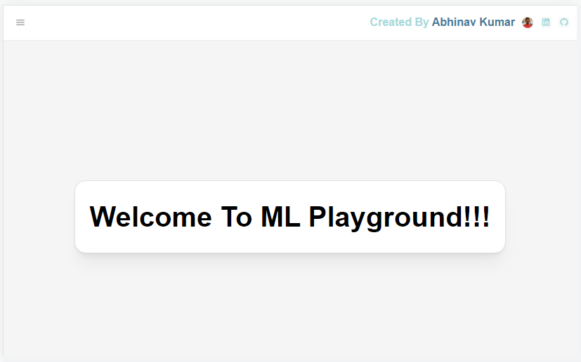

# Machine Learning Playground

## Table of contents
* [Introduction](#introduction)
* [Features](#features)
* [Getting Started](#getting-started)

## Introduction
The Machine Learning Playground is a project aimed at providing a platform for experimenting and visualizing various machine learning algorithms. The project aims to help users get a quick and easy understanding of different machine learning models by allowing them to upload their own data and build their models on the platform.

## Features
Ver1 - Kmean Clustering Playground -
In its first version, the Machine Learning Playground has a k-means clustering playground where users can upload their own data, check initial data features, build k-mean models with different clusters and visualize the output. The platform allows users the ability to adjust various parameters such as the number of clusters and analysis of the final output.

Ver2 - DBSCAN Clustering Playground -
Have added a new DBSCAN clustering playground in version 2. With DBSCAN, users do not need to specify the number of clusters in advance; instead, they only need to set two parameters: eps and min_samples. This makes it easier for users to explore and understand the structure of their data.
Also added a feature importance calculation using a surrogate model decision tree. This allows users to better understand which features are most important in their data and how they affect the performance of their models.

Ver3 - Hierarchical Clustering Playground -
Have added a new hierarchical clustering playground in version 3. With hierarchical clustering, users can visualize the dendrogram and estimate the number of clusters in their data. This makes it easier for users to understand the hierarchical structure of their data and identify meaningful clusters.

In the future, the project aims to support additional machine learning models, including logistic regression, decision trees and more. Each model will be accopmanied by a dedicated playground which feature similar charcteristics as the current k-mean playground.

## Getting Started
App has been deployed and Can access from [here](https://ml-playground-ewzf.onrender.com/)

Thank you for using the Machine Learning Playground!